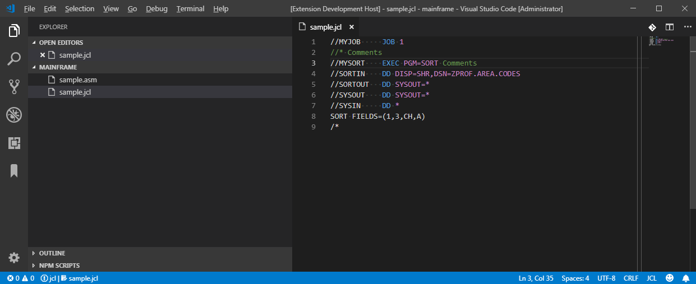

# ibm-jcl README

Extension "ibm-jcl".

## Features

Basic highlighting for IBM mainframe Job Control Language (JCL).

> Tip: Add editor configuration in user.settings to highlight continuation column, e.g. `"editor.rulers": [71, 72, 80],`

## Requirements

n/a

## Extension Settings

n/a

## Known Issues

n/a

## Release Notes

n/a

### 1.0.0

n/a

### 1.0.1

n/a

### 1.1.0

n/a
