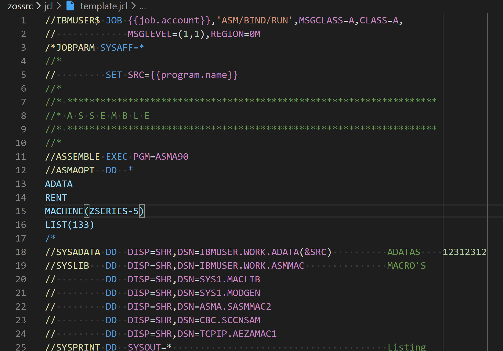

# JCL Highlighting Extension for VS Code

Minimum featured JCL highlighter for VS Code.

> Tip: Add editor configuration in `user.settings` to highlight continuation column, e.g. `"[jcl]" : { "editor.rulers" : [71, 72, 80]},`

## Features

Basic highlighting and symbol resolution `Ctrl + Shift + O`:

## Contributing

Pull requests welcome!
